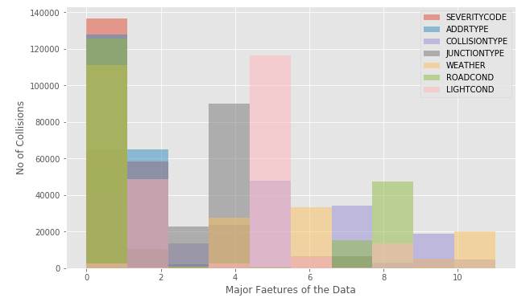

# Coursera_Capstone
Hello, I'm **Mohamed Jafir Ashraf**. This my capstone project in corsera, IBM. In this notebook will be mainly used for the capstone project.

# Table of Content
<ul>
 <li>Introduction
  <ul><li>Problem Description</li>
   <li>Data Understanding</li></ul>
 </li>
 <li>Data Preparation</li>
 <li>Exploratory Data Analysis</li>
 <li>Modeling</li>
 <li>Conclusion</li>
</ul>

 
<h1>Introduction</h1>
<h2>Problem Description</h2>

## Collisions
A collision is the event in which two or more bodies exert forces on each other in about a relatively short time. Although the most common use of the word collision refers to incidents in which two or more objects collide with great force, the scientific use of the term implies nothing about the magnitude of the force.

## Trafic Collisions - All years

A traffic collision, also called a motor vehicle collision, car accident, or car crash, occurs when a vehicle collides with another vehicle, pedestrian, animal, road debris, or other stationary obstruction, such as a tree, pole or building. Traffic collisions often result in injury, disability, death, and property damage as well as financial costs to both society and the individuals involved.

The field of Active Safety with respect to motor vehicles is concerned with the prevention of accidents before they happen. Warning drivers about the possibility of accidents and their severity due to weather, road, and visibility conditions is a new approach to prevent or reduce accidents before they take place.

  
This include corresponds to the severity of the collision: 
 <ul><li>Fatality </li>
    <li> Serious injury </li>
    <li> Injury</li>
 <li>Property damage </li>
</ul>
The traffic control stations would be known for traffic collisions often result in injury, disability, death, and property damage as well as financial costs to both society and the individuals involved. All collisions provided by SPD and recorded by Traffic Records.
 
Type of Collision address
 

<h2>Data Understanding</h2>
 <h3>Data Set Basics</h3>
<ol>
 <li>Title - Collisions—All Years</li>
 <li>Abstract - All collisions provided by SPD and recorded by Traffic Records. </li>
 <li>Description - This includes all types of collisions. Collisions will display at the intersection or mid-block of a segment. </li>
 <li>Update Frequency - Weekly </li>
</ol>
 <h3>Contact Information</h3>
<ol>
 <li>Contact Organization - SDOT Traffic Management Division, Traffic Records Group </li>
 <li>Contact Person - SDOT GIS Analyst</li>
</ol>
Notebook link :<a href='https://github.com/JafirDon/Coursera_Capstone/blob/master/code/Problem%20description%20and%20Data%20Understanding%20.ipynb'>Problem Description and Data Understanding</a>

<h2>Data Preparation</h2>
First downloaded the data from source and find the data information, description and shape of the data in after analysis. There were a lot of missing values from dataset, because of lack of record keeping. I decided to only use data for categorical values, because most column values are categorical and its help to easy to find a prediction value.
 Data set has to several problems, so start the cleaning of data. First, the data contain different columns with same values.
 Second, there were lot of missing values from dataset.
 Third, the data columns of datatype isn’t related to other data columns. Many columns are contain object type of datatype. And then some other columns are complicated values like date, float and negative values. After drop the unwanted columns based on further analysis.
 After fixing these problems, I checked for outliers in the data. I found there were some extreme outliers, mostly caused by some types of small sample size problem.
 Final step of the Data acquisition, Feature selection is important to the predictive modelling. After data cleaning, there were 194673 samples and 49 features in the data. Upon examining the meaning of each feature, it was clear that there was some redundancy in the features.

Notebook link:<a href='https://github.com/JafirDon/Coursera_Capstone/blob/master/code/Data%20Preparation%20.ipynb'>Data Preparation</a>

<h2>Explorotory Data Analysis</h2>
1. Histogram of the data separated into each columns based on number of collisions. There are address type, junction type, collision type and others. The separate columns are highlights to the different colours with labels.

